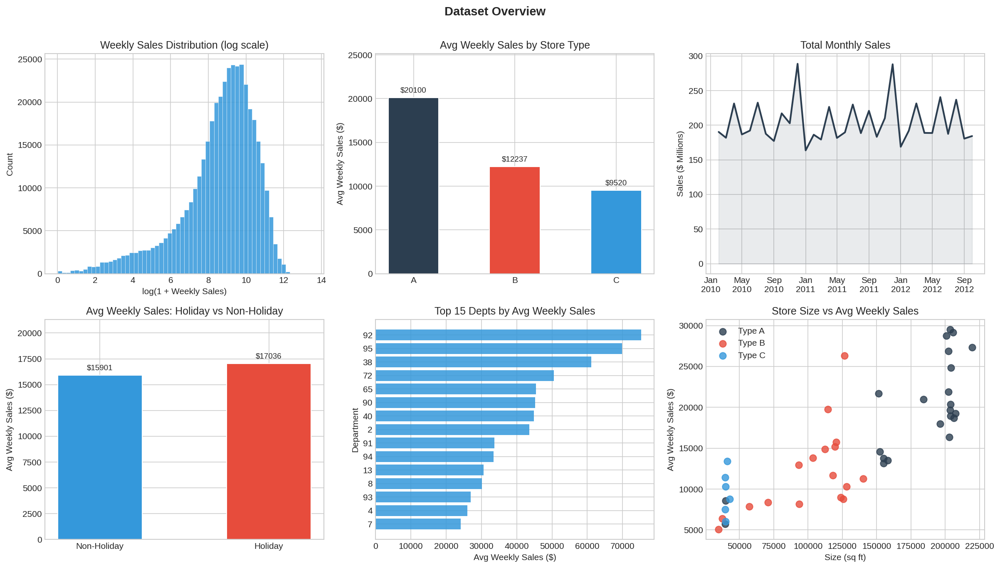
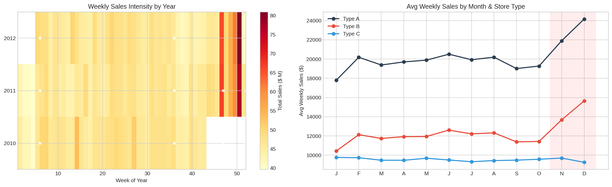
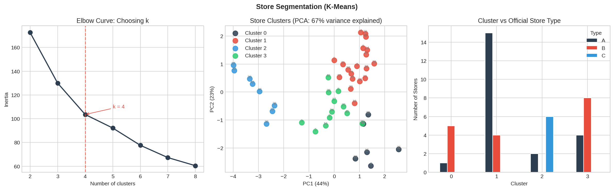
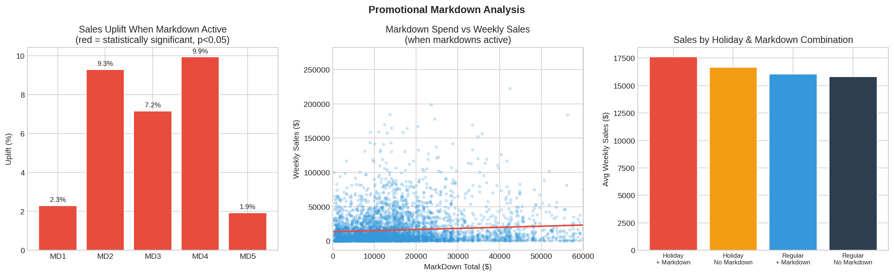

# Retail Analytics with a GPT-4o LangChain Agent

**Exploratory retail analytics powered by a LangChain pandas agent (GPT-4o). Python owns the stats, the agent owns the narrative.**

<br>

<p align="center">
  
</p>

<br>

## What this project does

Retail data is dense. 45 stores, 81 departments, 3 years of weekly sales enriched with markdown spend, CPI, unemployment, and store metadata. Enough to answer dozens of analytical questions, each of which normally means writing more aggregation code, more statistical boilerplate, more interpretation glue.

This notebook takes a different approach. A 421,570-row dataset gets the full analytical treatment in Python: statistical tests, time series decomposition, K-Means segmentation, and hypothesis testing.

A **LangChain pandas agent backed by GPT-4o** then interprets every result, synthesises cross-sectional findings, and answers open-ended business questions against the live DataFrame in plain English. Python handles everything that needs to be reproducible. The agent handles everything that benefits from natural language.

<br>

## Why this exists

Most LLM-in-a-notebook demos fall into one of two traps: either the LLM does everything (including unreliable statistics), or it does nothing beyond summarising text. This notebook draws a deliberate line:

| What runs in Python | What runs through the agent |
|---|---|
| Welch t-tests, Mann-Whitney U, ANOVA, Tukey HSD | Interpreting pre-computed test results in business context |
| STL decomposition, ADF stationarity test | Explaining what the decomposition means for forecasting |
| K-Means clustering, PCA, silhouette validation | Naming clusters, identifying where they diverge from official labels |
| Pearson correlations, stratified confounding checks | Synthesising macro, markdown, and holiday effects simultaneously |
| All visualisations (matplotlib, seaborn) | Open-ended Q&A: querying the DataFrame directly via natural language |

Every formal number in the notebook is independently reproducible without the LLM. The agent adds the interpretive layer that makes the analysis readable.

<br>

## Key findings

**Type C stores are the most space-efficient format** at $0.24/sqft vs $0.12 for Type A, and the most sales-stable. Bigger is not more efficient.

**Thanksgiving dominates the holiday calendar at +39.8% uplift**, 13x the Super Bowl effect. The Christmas holiday flag marks the wrong week; the actual peak is the unflagged Week 51 ($157.9M).

**MarkDown2 and MarkDown4 deliver the strongest promotional lift** (~9-10%), with clear diminishing returns above the low-spend tercile. The marginal markdown dollar is far less effective than the first.

**Markdowns are deployed to already-strong stores** (r = 0.819 between store markdown spend and average sales), making the observed uplift partially a selection effect. A randomised rollout would be needed to isolate the true promotional lift.

**29 of 81 departments generate 80% of chain revenue.** Dept 72 doubles its sales during holiday weeks, making it the highest-leverage department for seasonal inventory planning.

**Type C stores grow in high-unemployment markets** while Types A and B decline. This resilience pattern is invisible in the official A/B/C store classification.

<br>

## Notebook structure

The notebook is organised into 16 sections. Each analytical section follows the same pattern: Python computes, the agent interprets, and a blue callout box evaluates the agent's output with additional context.

| # | Section | What happens |
|---|---|---|
| 1 | Setup | Pinned dependencies, imports, API key |
| 2 | Data | Three-table merge, feature engineering, quality checks |
| 3 | The LLM Agent | Agent initialisation with full domain context |
| 4 | Exploratory Analysis | Agent queries the DataFrame directly for distributional overview |
| 5 | Seasonality & Sales Patterns | Holiday uplift by event, YoY growth, STL decomposition, ADF test |
| 6 | Store Performance | Sales per sqft, volatility (CV), outlier identification |
| 7 | Markdown Effectiveness | Welch t-tests per type, stratified confounding checks, diminishing returns |
| 8 | Macroeconomic Context | Unemployment and CPI correlations, multicollinearity check |
| 9 | Store Segmentation | K-Means (k=4), PCA, silhouette validation, cluster profiling |
| 10 | Hypothesis Testing | H1-H4 with parametric + non-parametric parallel tests |
| 11 | Department Analysis | Revenue concentration, holiday sensitivity, YoY growth trajectories |
| 12 | Synthesis | Cross-sectional analysis combining all prior findings |
| 13 | Open-Ended Q&A | Agent answers ad-hoc questions against the live DataFrame |
| 14 | Executive Summary | Agent-generated board-ready narrative with verified numbers |
| 15 | Limitations & Caveats | What the analysis can and cannot claim |
| 16 | Reflections | What the agent enabled and what required careful prompt design |

<br>

## Tech stack

| Layer | Tools |
|---|---|
| LLM Agent | LangChain 0.3.23 · langchain_experimental 0.3.4 · OpenAI GPT-4o |
| Statistical tests | scipy · statsmodels (ADF, STL, Tukey HSD) |
| Machine learning | scikit-learn (K-Means, PCA, silhouette scoring) |
| Data & visualisation | pandas · numpy · matplotlib · seaborn |
| Environment | Google Colab (GPU not required) |

<br>

## How to run

**1. Clone the repo**
```bash
git clone https://github.com/YOUR_USERNAME/retail-analytics-gpt4o-langchain-agent.git
cd retail-analytics-gpt4o-langchain-agent
```

**2. Upload to Google Colab** (recommended) or run locally with Jupyter

**3. Add your OpenAI API key** via Colab Secrets (🔑 icon in the left sidebar). The notebook reads it from `OPENAI_API_KEY`.

**4. Run all cells.** Dependencies install automatically. Expect ~15-20 minutes for a full run and ~$2-3 in API costs (GPT-4o).

<br>

## Dataset

[Walmart Retail Dataset](https://www.kaggle.com/datasets/manjeetsingh/retaildataset) from Kaggle. Three CSV files:

| File | Contents | Rows |
|---|---|---|
| `sales data-set.csv` | Store × Dept × Week × Sales | 421,570 |
| `Features data set.csv` | Markdowns, CPI, unemployment, temperature per store/week | 8,190 |
| `stores data-set.csv` | Store type (A/B/C) and size in sqft | 45 |

Place the three files in a `data/` directory at the project root.

<br>

## Project structure

```
retail-analytics-gpt4o-langchain-agent/
├── retail_sales_analysis_FINAL.ipynb    # The notebook
├── data/
│   ├── sales data-set.csv
│   ├── Features data set.csv
│   └── stores data-set.csv
├── plots/                               # Auto-generated visualisations
│   ├── 01_overview.png
│   ├── 02_seasonality.png
│   ├── 03_store_performance.png
│   ├── 04_markdowns.png
│   ├── 05_clusters.png
│   ├── 06_departments.png
│   ├── 07_synthesis.png
│   ├── stl_decomposition.png
│   ├── silhouette.png
│   ├── multicollinearity.png
│   ├── outliers.png
│   └── dept_yoy_growth.png
└── README.md
```

<br>

## Sample visualisations

<p align="center">
  <br>
  <em>Weekly sales heatmap and monthly patterns by store type</em>
</p>

<p align="center">
  <br>
  <em>K-Means segmentation: where behavioural clusters diverge from official A/B/C labels</em>
</p>

<p align="center">
  <br>
  <em>Markdown effectiveness: uplift by type, diminishing returns, and holiday interaction</em>
</p>

<br>

## What the agent actually does (and doesn't do)

The agent operates in two distinct modes across the notebook:

**Interpretation mode** (Sections 5-12, 14): Python pre-computes every statistical result, then passes it to the agent as structured context. The agent translates numbers into business-language findings. It never runs its own calculations in these sections. Every number is independently verifiable.

**Exploration mode** (Sections 4, 13): The agent writes and executes Python code against the live DataFrame to answer open-ended questions. This is the intended use case for `create_pandas_dataframe_agent`: replacing ad-hoc groupby chains with natural language queries.

<br>

## What worked well

- **Open-ended Q&A as intended.** A question like "which departments perform worse during holiday weeks?" would traditionally require a groupby, a significance test, and a narrative. The agent collapsed all three into one prompt, querying `df` directly.
- **Cross-dimensional synthesis.** The Synthesis section connects six prior sections in a single prompt (holiday uplift, markdown responsiveness, unemployment, growth), replacing substantial custom join code with one internally consistent output.
- **Interpretation at scale.** Five markdown types, four holiday events, four hypothesis tests, four cluster segments: the agent handled the full pattern in single invocations and surfaced the statistical-vs-practical significance gap (H3's r² = 0.016) without being prompted toward it.

<br>

## What required careful design

- **Knowing when not to delegate computation.** The agent runs each code block in an isolated namespace, so imports and variables don't persist. Multi-step statistical pipelines broke silently. Keeping all formal analysis in Python and passing verified results as context made every number independently reproducible.
- **Prompt precision determines output quality.** A 15-word addition (`NOT temperature, NOT CPI`) eliminated a persistent mislabelling. Embedding the 2012 truncation note and the Christmas flag timing caveat in context produced correct interpretations where unconstrained prompts produced misleading ones. The model had the knowledge; the prompt was the interface.

<br>

## The bigger picture

This notebook started as a retail analysis and turned into a proof of concept for something more general: **what happens when you stop asking LLMs to be calculators and start asking them to be analysts.**

The agent didn't replace Python. It replaced the hours spent translating numbers into narrative. The statistical tests, the clustering, the decomposition all still run in deterministic, auditable code. What the agent added was the connective tissue between sections: the ability to ask "what does this mean for the business?" and get a coherent answer that draws on six prior findings at once.

That pattern transfers. Financial reporting, clinical trial analysis, operational dashboards, customer behaviour research: anywhere you have structured data and need to move from "here are the numbers" to "here's what they mean", the same division of labour applies. The dataset changes, the prompts change, the principle stays the same.

<br>

## Author

**Antonis Tsiakiris** · [GitHub](https://github.com/AntonisXT) · [LinkedIn](https://www.linkedin.com/in/antonis-tsiakiris)

<br>

## License

MIT

<br>

## Disclaimer

This project is for educational and portfolio purposes. The [Walmart Retail Dataset](https://www.kaggle.com/datasets/manjeetsingh/retaildataset) is publicly available on Kaggle under its original license. All findings are analytical observations on historical data and should not be interpreted as business advice.
